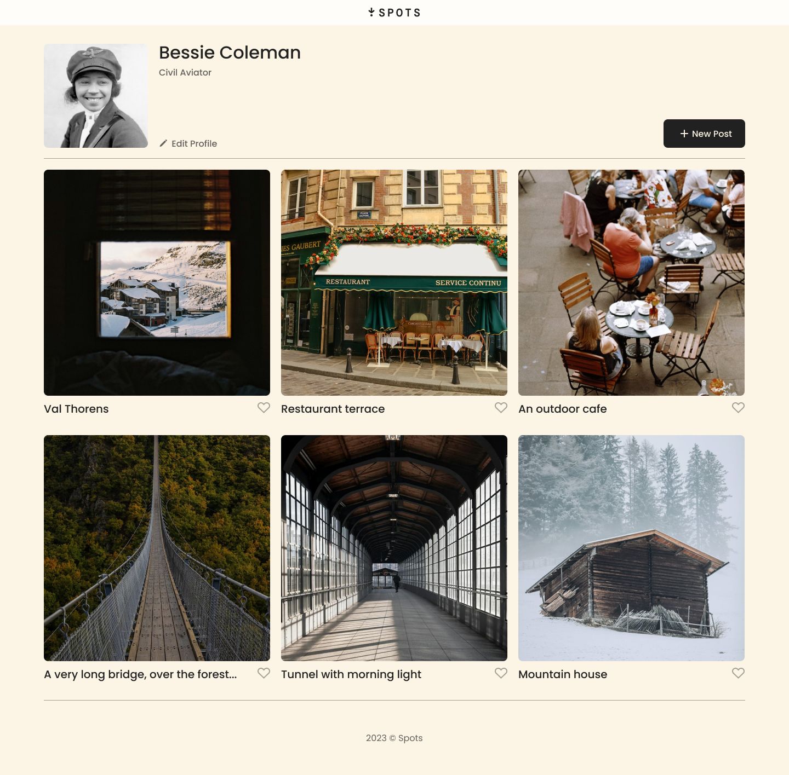

# Spots

## Overview

The Spots project was created as a gallery for the user to be able to store their images they'd like to showcase. The project was developed with responsiveness in mind, meaning that this can work on the most popular screen sizes, including tablets and mobile phones.

### Technology

This was used with basic HTML and CSS inclduing grids, flex containers, as well as media queries to allow for responsive design.

### Images

### Deployment

This was deployed on GitHub Pages. View this project [here](https://danacorona.github.io/se_project_spots/).

#### Figma

- [Link to the project on Figma](https://www.figma.com/file/BBNm2bC3lj8QQMHlnqRsga/Sprint-3-Project-%E2%80%94-Spots?type=design&node-id=2%3A60&mode=design&t=afgNFybdorZO6cQo-1)

### Project Pitch Videos

Check out these videos where I have descibed my project as well as the challenges faced while building it.
[Early Stages of Development](https://drive.google.com/file/d/1WmjDrIbqm-YNpAi_09PE94G8czBFh7My/view?usp=sharing)

[Stages of Implementing Javascript Validation](https://drive.google.com/file/d/1jNJ2SBG2usLzSfmCqFLqeSmm6Ygx92iu/view?usp=sharing)
